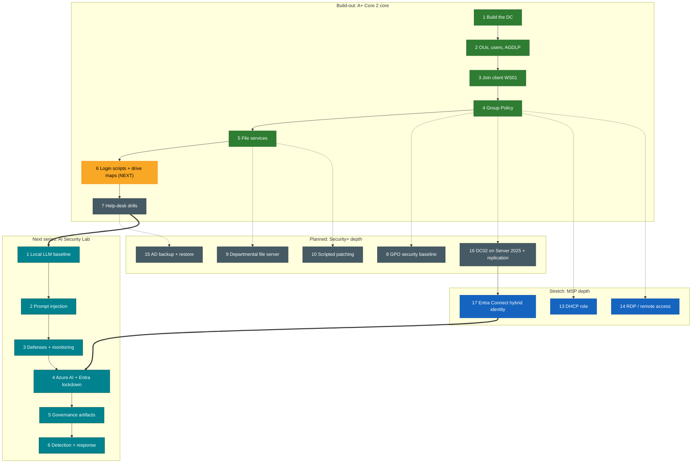

# Lab Map

One screen, the whole path. Green is done, amber is the current phase, grey is planned, blue is stretch, teal is the next series. Solid arrows are hard dependencies; dotted arrows are softer ones; thick arrows are the bridge into AI security.

## Where you are

Phases 1 through 5 are complete: a healthy `corp.lab` domain with OUs, users, AGDLP groups, a domain-joined client, Group Policy, file shares, and redirected home folders. **Phase 6 (login scripts and drive maps) is the current step.** The live counter on the [Home](index.md) page is the source of truth.

## How the tracks relate

- **Build-out (1-7)** is the A+ Core 2 core. Each phase assumes the prior one finished cleanly.
- **Planned (8-10, 15-16)** is the committed roadmap, sequenced for Security+ (SY0-701): hardening, least-privilege file services, patching, recovery, and resilience. Phases 15 and 16 keep their original numbers from the old stretch track so existing links stay valid.
- **Stretch (13-14, 17)** is optional MSP depth. DHCP and RDP branch off a working domain independently. The second DC (16) and Entra Connect (17) form the hybrid-identity chain.
- **AI Security Lab** is the next guide. It reuses this same homelab. Two bridges connect the tracks: finishing the AD build-out leads into the local-LLM work, and Entra Connect (17) feeds directly into securing a cloud AI service with these synced identities (AI Phase 4). See [Next Lab Series](next-lab-series.md).
